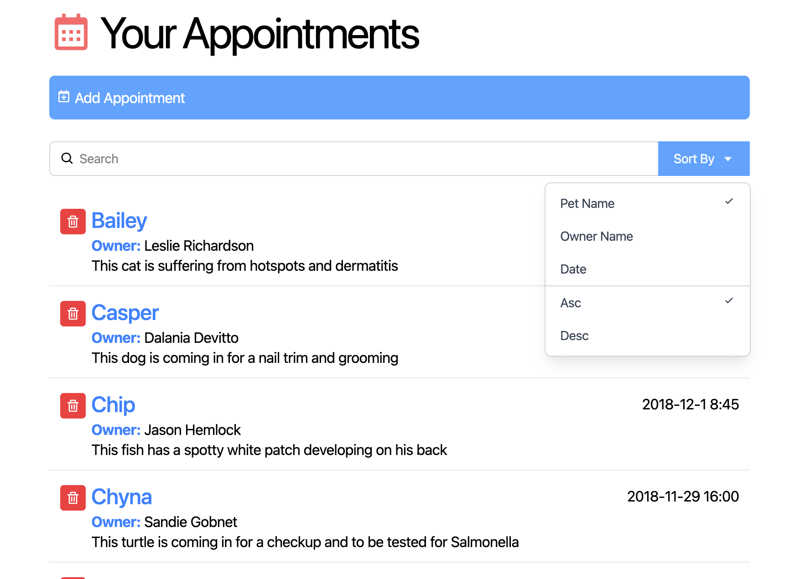

# Vet Appointment Booking App

A modern web application for booking veterinary appointments built with React and Vite.



## Tech Stack

- **Frontend Framework**: React 19
- **Build Tool**: Vite
- **Styling**: Tailwind CSS

## Prerequisites

- Node.js (v16+)
- npm or yarn

## Installation

1. Clone the repository:

```bash
git clone https://github.com/trevorcj/book-vet
cd book-vet
```

2. Install dependencies:

```bash
npm install
```

## Running Locally

Start the development server:

```bash
npm run dev
```

The app will be available at `http://localhost:5173`

## Building for Production

```bash
npm run build
npm run preview
```

## Available Scripts

- `npm run dev` - Start development server
- `npm run build` - Build for production
- `npm run preview` - Preview production build
- `npm run lint` - Run ESLint
